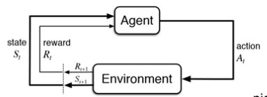
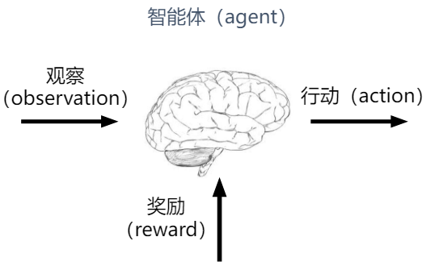

# Course outline
Markov decision processes(MDPs)
Model-based/Model-free Methods
Value-based/Policy-based Methods
Deep Reinforcement Learning
Recent Advances

### Application：Deep Reinforcement Learning
Atari(DQN)  [Deepmind]
Human-level control  [Deepmind]
ALphaGo  [Deepmind]
3D locomotion(TRPO+GAE)  [Berkeley]
Real Robot Manipulation(GPS)  [Berkeley]
Rubik's Cube(PPO+DR)  [OpenAI]

**What's the main idea behind this?**

### Reinforcement Learning can discover new solutions

**What's Reinforcement Learning?**
1. **Mathematical** fomalization for learning-based decision making
2. Approach for learning decision making and control from **experience**

**Difference from other machine learning topics?**
标准机器学习（监督学习）：
1. dataset固定，学习得到一个函数，用来预测某个输入对应的输出，通常假设dataset是i.i.d,label已知。
2. input: x
output: y
data: {(x, y)} given by someone
goal: f(x) $\approx$ y

强化学习：
1. dataset是自己收集的，根据不同的算法，收集到的数据集不同。整局游戏结束后才知道胜负，Ground truth未知，奖励信号稀疏，只知道reward。
2. input: $s_t$ at each step
output: $a_t$ at each time step
data: $(s_1, a_1, r_1,\dots)$
goal: learn $\pi_{\theta}: s_t \rightarrow a_t$ to maximize $\sum_t r_t$

## 强化学习技术概览
两种人工智能任务类型：
预测（supervised、unsupervised）、决策（reinforcement learning）

### 序贯决策（sequential decision making）都可以用强化学习解决

### 强化学习定义
通过从交互中学习来实现目标的计算方法

三个方面：
感知、行动、目标

### 交互过程
1. 在每一步t，智能体：
获得观察$O_t$
获得奖励

2. 环境

### 在与动态环境的交互中学习 Dynamic Environment
agent不同，交互出的数据也不同（与监督学习的最大不同点）

### 强化学习系统要素
1. History是Observation, action, reward的序列
$H_t = O_1, R_1, A_1, O_2, R_2, A_2,\dots, O_t, R_t, A_t$
即到时间t为止的所有可观测变量。
根据历史，决定接下来会发生什么。

2. state是描述环境的所有信息，可用于确定接下来会发生的事情（行动、观察、奖励）
状态是关于历史的函数。

**What is a state?**
**World state** includes every last detail of the environment.
**Search atate** keeps only the details needed for planning.
如：解决路径规划问题，只需要知道位置信息。
Eat-All-Dots问题，状态还要包括dot booleans.

3. Policy是agent在特定时间的行为方式
$\pi: S \rightarrow \Delta(A)$

state space到Action space的所有概率分布的集合

**确定性策略（deterministic policy）**
$a = \pi(s)$
**随机策略（stochastic policy）**
$\pi(a|s) = P(A_t = a|S_t = s)$

4. Reward R(s,a,s')
一个定义强化学习目标的标量
能立刻感知到什么是“好”的

**Utility of Sequences**
// discounting: 贴现，折现，票贴。指将未来的货币转换成当前货币的实际价值，与累积（Accumulation：对货币的时间价值的计算，在计算利息时常用。）是相反的概念和过程。

Q: what preferences should an agent have over reward sequences?
A: prefer more over less; now[1,0,0] over later[0,0,1].

Stationary Preferences

Additive utility
Discounted utility(常用)

5. Value Function:状态价值，是一个标量，用于定义对于**长期来说**什么是“好”的。

价值函数是对未来累积奖励的预测。用于评估在给定的策略下，状态的好坏。

6. Model，环境的模型，用于模拟环境的行为。
预测下一个状态：state transition
预测下一个立即奖励 immediate reward

对于环境：主要看环境是如何变化的，以及环境给智能体的奖励。

### 强化学习的方法分类

基于价值：没有策略

基于策略：没有价值函数

Actor-Critic：有策略，有价值函数

### 价值和策略近似
借助深度神经网络建立Q和pi的函数近似：深度强化学习！

2013.12 第一篇深度强化学习论文出自NIPS

深度强化学习：利用深度神经网络进行价值函数和策略近似，从而使强化学习算法能够以端到端的方式解决复杂问题。

### 深度强化学习带来的关键变化

价值函数和策略用深度神经网络近似
过拟合
不稳定
高性能计算
大量数据
...

### 深度Q网络

### DRL研究前沿
1. Model-based RL 基于模拟模型的RL: 建立环境模拟器，在模拟器中训练强化学习，减少对真实环境的影响，也可以生成更多特定场景的数据
2. Goal-oriented RL 目标策动的RL：生成中间状态，将常期限任务分割成多个简单的短期限任务
3. Imitation Learning 模仿学习：自动驾驶（waymo）
4. Multi-agent RL 多智能体RL：环境是非稳态的non-stationary，环境迁移的分布会发生改变

### 落地场景
无人驾驶、游戏AI、交通灯调度、网约车派单、组合优化、推荐搜索、数据中心节能优化...

